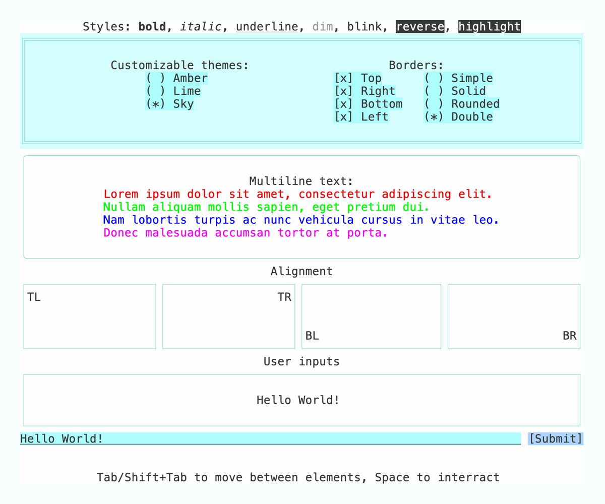

<a name="readme-top"></a>

<!-- [![Contributors][contributors-shield]][contributors-url]
[![Forks][forks-shield]][forks-url]
[![Stargazers][stars-shield]][stars-url]
[![Issues][issues-shield]][issues-url]
[![MIT License][license-shield]][license-url]
[![LinkedIn][linkedin-shield]][linkedin-url]
<br /> -->

<!-- PROJECT LOGO -->
<div align="center">
  <!--a href="https://github.com/akarpovskii/tuile">
    
  </a-->

<h3 align="center">Tuile</h3>

  <p align="center">
    A Text User Interface library for Zig.
    <br />
    Breaking changes are possible.
    <br />
    <a href="https://github.com/akarpovskii/tuile"><strong>Explore the docs »</strong></a>
    <br />
    <br />
    <a href="https://github.com/akarpovskii/tuile/tree/main/examples">View Examples</a>
    ·
    <a href="https://github.com/akarpovskii/tuile/issues/new?labels=bug&template=bug-report.md">Report Bug</a>
    ·
    <a href="https://github.com/akarpovskii/tuile/issues/new?labels=enhancement&template=feature-request.md">Request Feature</a>
  </p>
</div>


<!-- TABLE OF CONTENTS -->
<details>
  <summary>Table of Contents</summary>
  <ol>
    <li>
      <a href="#about-the-project">About The Project</a>
    </li>
    <li>
      <a href="#getting-started">Getting Started</a>
      <ul>
        <li><a href="#prerequisites">Prerequisites</a></li>
        <li><a href="#installation">Installation</a></li>
      </ul>
    </li>
    <li><a href="#usage">Usage</a></li>
    <li><a href="#roadmap">Roadmap</a></li>
    <li><a href="#contributing">Contributing</a></li>
    <li><a href="#license">License</a></li>
    <li><a href="#contact">Contact</a></li>
    <li><a href="#acknowledgments">Acknowledgments</a></li>
  </ol>
</details>


<!-- ABOUT THE PROJECT -->
## About The Project

Tuile is a Text User Interface library written in Zig.

The only currently supported backend is ncurses, but if you want to see another one submit a PR or file a [feature request](https://github.com/akarpovskii/tuile/issues/new?labels=enhancement&template=feature-request.md).



Checkout the other examples [here](./examples/).

<p align="right">(<a href="#readme-top">back to top</a>)</p>


<!-- GETTING STARTED -->
## Getting Started

### Prerequisites

* Zig 0.12.0+
* ncurses
    * macOS

        A version of ncurses should already be installed in your system (or is it shipped with XCode and the command line tools?), so you don't have to do anything.

        Alternatively, you can install a different version using Homebrew:
        ```sh
        brew install ncurses
        ```
        In which case you might need to tell Zig where to find the library by adding `exe.addLibraryPath(...)` to you `build.zig`.

    * Linux

        ```sh
        sudo apt-get install libncurses5-dev libncursesw5-dev
        ```

    * Windows

        Prebuilt binaries are available on the [official website](https://invisible-island.net/ncurses/#download_mingw).

        _TODO: Add a specific instruction._

### Installation

1. Add dependency to your `build.zig.zon`

```sh
zig fetch --save https://github.com/akarpovskii/tuile/archive/refs/tags/v0.1.0.tar.gz
```

2. Import Tuile in `build.zig`:

```zig
const tuile = b.dependency("tuile", .{});
exe.root_module.addImport("tuile", tuile.module("tuile"));
```

<p align="right">(<a href="#readme-top">back to top</a>)</p>


<!-- USAGE EXAMPLES -->
## Usage

```zig
const tuile = @import("tuile");

pub fn main() !void {
    var tui = try tuile.Tuile.init(.{});
    defer tui.deinit();

    try tui.add(
        tuile.block(
            .{
                .border = tuile.Border.all(),
                .border_type = .rounded,
                .layout = .{ .flex = 1 },
            },
            tuile.label(.{ .text = "Hello World!" }),
        ),
    );

    try tui.run();
}
```

You can find more examples in the [examples folder](./examples/)

<p align="right">(<a href="#readme-top">back to top</a>)</p>


<!-- ROADMAP -->
## Roadmap

In no particular order:

- [ ] CI on Windows needs ncurses - figure out how to do it
- [ ] Documentation
- [ ] Grid layout
- [ ] Windows and dialogs
- [ ] Menu bar
- [ ] More widgets
- [ ] Other backends
- [ ] Unicode support

See the [open issues][issues-url] for a full list of proposed features (and known issues).

<p align="right">(<a href="#readme-top">back to top</a>)</p>


<!-- CONTRIBUTING -->
## Contributing

If you have a suggestion that would make this better, please fork the repo and create a pull request. You can also simply open an issue with the tag "enhancement".
Don't forget to give the project a star! Thanks!

1. Fork the Project
2. Create your Feature Branch (`git checkout -b feature/amazing-feature`)
3. Commit your Changes (`git commit -m 'Add some Amazing Feature'`)
4. Push to the Branch (`git push origin feature/amazing-feature`)
5. Open a Pull Request

<p align="right">(<a href="#readme-top">back to top</a>)</p>


<!-- LICENSE -->
## License

Distributed under the MIT License. See [`LICENSE`][license-url] for more information.

<p align="right">(<a href="#readme-top">back to top</a>)</p>


<!-- ACKNOWLEDGMENTS -->
## Acknowledgments

* [Best-README-Template](https://github.com/othneildrew/Best-README-Template)

<p align="right">(<a href="#readme-top">back to top</a>)</p>


<!-- MARKDOWN LINKS & IMAGES -->
<!-- https://www.markdownguide.org/basic-syntax/#reference-style-links -->
[contributors-shield]: https://img.shields.io/github/contributors/akarpovskii/tuile.svg?style=for-the-badge
[contributors-url]: https://github.com/akarpovskii/tuile/graphs/contributors
[forks-shield]: https://img.shields.io/github/forks/akarpovskii/tuile.svg?style=for-the-badge
[forks-url]: https://github.com/akarpovskii/tuile/network/members
[stars-shield]: https://img.shields.io/github/stars/akarpovskii/tuile.svg?style=for-the-badge
[stars-url]: https://github.com/akarpovskii/tuile/stargazers
[issues-shield]: https://img.shields.io/github/issues/akarpovskii/tuile.svg?style=for-the-badge
[issues-url]: https://github.com/akarpovskii/tuile/issues
[license-shield]: https://img.shields.io/github/license/akarpovskii/tuile.svg?style=for-the-badge
[license-url]: https://github.com/akarpovskii/tuile/blob/master/LICENSE.txt
[examples-url]: https://github.com/akarpovskii/tuile/tree/main/examples
[linkedin-shield]: https://img.shields.io/badge/-LinkedIn-black.svg?style=for-the-badge&logo=linkedin&colorB=555
[linkedin-url]: https://linkedin.com/in/akarpovskii
[product-screenshot]: images/screenshot.png
