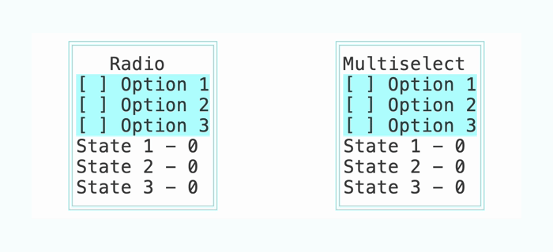
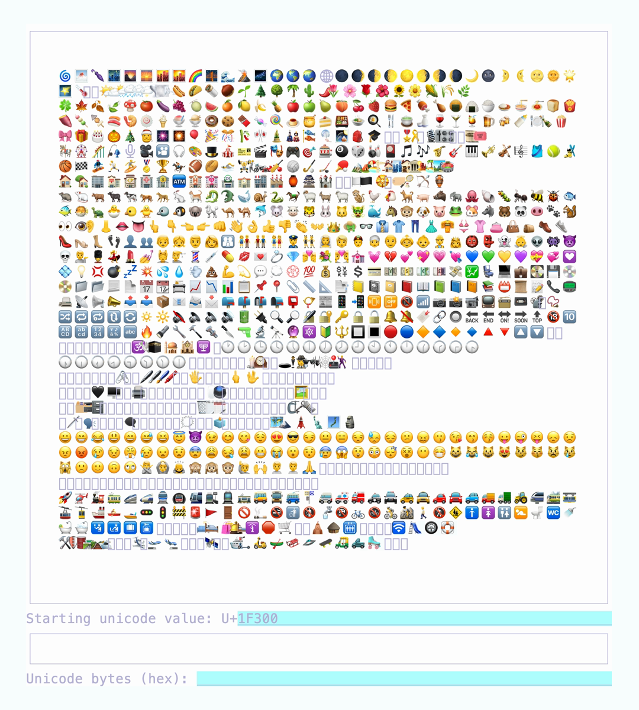

# Examples

To run an example, use `zig build <exaple name>`, e.g. `zig build demo`.

All examples were recorded using [VHS](https://github.com/charmbracelet/vhs). Corresponding tapes can be found in the [`images`](./images/) folder.

## Selecting a Backend

To select a backend in the examples, add `-Dbackend=<backend name>` to `zig build` command. For example:

```zig
zig build demo -Dbackend=crossterm
```

See [`Backends`](../docs/Backends.md) for more info.

## [`demo`](./src/demo.zig)

Simple demo showcasing the library capabilities.

<details>
  <summary>VHS recording</summary>

  

</details>

## [`palette`](./src/palette.zig)

256 bit palette

<details>
  <summary>VHS recording</summary>

  
</details>

## [`checkbox`](./src/checkbox.zig)

Radio buttons and multiselect checkboxes

<details>
  <summary>VHS recording</summary>

  
</details>

## [`threads`](./src/threads.zig)

Updating UI from another thread via `scheduleTask`

<details>
  <summary>VHS recording</summary>

  
</details>

## [`input`](./src/input.zig)

Simple user input processing

<details>
  <summary>VHS recording</summary>

  
</details>

## [`event_handler`](./src/event_handler.zig)

How to handle key presses using a standalone function

<details>
  <summary>VHS recording</summary>

  
</details>

## [`fps_counter`](./src/fps_counter.zig)

How to implement a custom widget using FPS counter as an example. Can be used to debug Tuile event loop.

<details>
  <summary>VHS recording</summary>

  
</details>

## [`unicode`](./src/unicode.zig)

Demo showcasing Unicode support

<details>
  <summary>VHS recording</summary>

  
</details>
